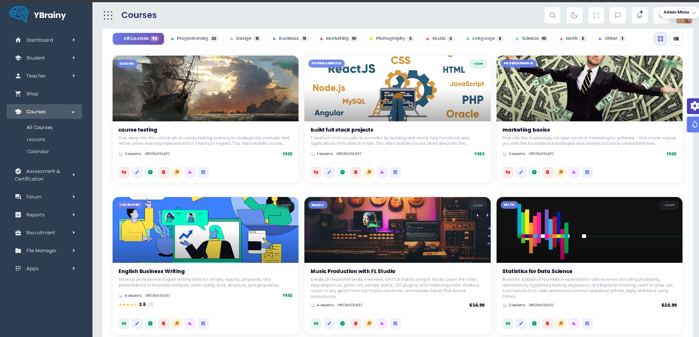

<p align="center">
  
</p>

<p align="center">
  
</p>

<p align="center">
  
  
  
</p>

<p align="center">
  
  
  
  
  
  
  
</p>

---

## Overview

YBrainy is a full-stack e-learning and certifications platform built for the ESPRIT integrated project program. It brings together course publishing, lesson delivery, quiz evaluation, certification, user management, events, forums, payments, recommendations, and AI-assisted learning experiences in one modular platform.

The project is organized as a distributed microservices system. Spring Boot services expose the backend features, Angular provides the web interface, Keycloak secures authentication, Eureka handles service discovery, and Docker Compose provides a reproducible local environment. The platform also includes Python/ML components for recommendation, conversion, quality, and assistance workflows.

This repository was prepared from the final `integration-final` branch for ESPRIT GitHub showcase submission.

## Demo Preview

<p align="center">
  
</p>

More screenshots and posters are available in [`demo/`](demo/).

## Main Features

| Area | Capabilities |
| --- | --- |
| Learning | Course catalog, lessons, progress tracking, quizzes, certifications |
| Users | Authentication, roles, profiles, instructor/student flows |
| Community | Forum, posts, comments, messaging, moderation support |
| Events | Event management, registrations, feedback, generated event media |
| Payment | Cart, checkout, finance-related services, payment workflows |
| AI/ML | Recommendations, quality signals, conversion models, AI assistance |
| DevOps | Docker Compose, CI/CD workflows, service monitoring foundations |

## Repository Structure

```text
.
├── README.md
├── .env.example
├── docs/
│   ├── architecture.md
│   ├── setup.md
│   ├── api.md
│   ├── database.md
│   ├── ai-models.md
│   └── submission-checklist.md
├── demo/
│   ├── screenshots/
│   └── posters/
└── PIDEV-YBrainy-E-leraning-certifications-Platform/
    ├── docker-compose.yml
    ├── user/
    ├── YBRAINY/
    ├── payment/
    ├── forum/
    ├── ybrainy events/
    └── run-services/
```

## Prerequisites

| Tool | Required version | Purpose |
| --- | --- | --- |
| Docker Desktop | Latest stable | Infrastructure and backend services |
| Java JDK | 17+ | Spring Boot services |
| Maven | 3.8+ | Java builds |
| Node.js | 18+ | Angular frontend |
| npm | 9+ | Frontend dependencies |
| Python | 3.10+ | ML services |

## Quick Start

Clone the repository:

```bash
git clone https://github.com/mohamedaziz-selmi/Esprit-PI-4SAE4-2526-YBrainy.git
cd Esprit-PI-4SAE4-2526-YBrainy
```

Create the environment file:

```bash
copy .env.example PIDEV-YBrainy-E-leraning-certifications-Platform\.env
```

On macOS/Linux:

```bash
cp .env.example PIDEV-YBrainy-E-leraning-certifications-Platform/.env
```

Start the backend and infrastructure:

```bash
cd PIDEV-YBrainy-E-leraning-certifications-Platform
docker compose up --build
```

Start the Angular frontend in a second terminal:

```bash
cd PIDEV-YBrainy-E-leraning-certifications-Platform/user/angular/angular-app
npm install
npm start
```

Open the application:

```text
http://localhost:4200
```

Useful service URLs:

| Service | URL |
| --- | --- |
| Angular frontend | http://localhost:4200 |
| API Gateway | http://localhost:8088 |
| Eureka | http://localhost:8761 |
| RabbitMQ UI | http://localhost:15672 |
| Zipkin | http://localhost:9411 |
| ML service | http://localhost:5000 |

## Environment Variables

The repository includes `.env.example` only. Real secrets must never be committed.

| Variable | Description |
| --- | --- |
| `STRIPE_SECRET_KEY` | Stripe secret key for payment tests |
| `STRIPE_PUBLISHABLE_KEY` | Stripe public key for frontend/payment tests |
| `STRIPE_WEBHOOK_SECRET` | Stripe webhook signing secret |
| `OPENROUTER_API_KEY` | AI assistant provider key |
| `GROQ_API_KEY` | Forum/thread AI provider key |
| `EVENT_GROQ_API_KEY` | Events AI provider key |
| `TTS_API_KEY` | Text-to-speech provider key |
| `CONTENT_WRITER_API_KEY` | Content generation provider key |
| `SPRING_MAIL_PASSWORD` | SMTP application password |
| `AUTH_JWT_SECRET` | Local JWT signing secret |
| `HF_TOKEN` | Hugging Face token for optional AI media features |
| `GITHUB_MODELS_API_KEY` | Optional GitHub Models API key |

## Documentation

| Document | Purpose |
| --- | --- |
| [`docs/setup.md`](docs/setup.md) | Full installation and launch guide |
| [`docs/architecture.md`](docs/architecture.md) | Architecture overview and service map |
| [`docs/api.md`](docs/api.md) | Main API gateway routes and module endpoints |
| [`docs/database.md`](docs/database.md) | Database strategy and sample data notes |
| [`docs/ai-models.md`](docs/ai-models.md) | AI/ML artifact policy and reproduction notes |
| [`docs/submission-checklist.md`](docs/submission-checklist.md) | ESPRIT publication checklist |

## Submission Compliance

| Requirement from ESPRIT guide | Status |
| --- | --- |
| Public GitHub repository | Ready to publish |
| Repository name format | `Esprit-PI-4SAE4-2526-YBrainy` |
| Complete root `README.md` | Present |
| `.gitignore` | Present |
| `.env.example` without real secrets | Present |
| `docs/` | Present |
| `demo/` | Present |
| Launch command documented | Present |
| Runtime uploads/build outputs excluded | Present |
| Credentials excluded from Git | Present |
| AI artifacts documented outside Git | Present |

## Authors

YBrainy Team  : 
Yassin Bouras - Mohamed Aziz Selmi - Bejaoui Iheb - Issam Riahi - Houssem Hbaieb - Jacem Jouili
Class: 4SAE4  
Academic year: 2025-2026  
School: ESPRIT School of Engineering

## License

Academic project prepared for ESPRIT project showcase submission. Reuse outside the academic context should cite the YBrainy team.
