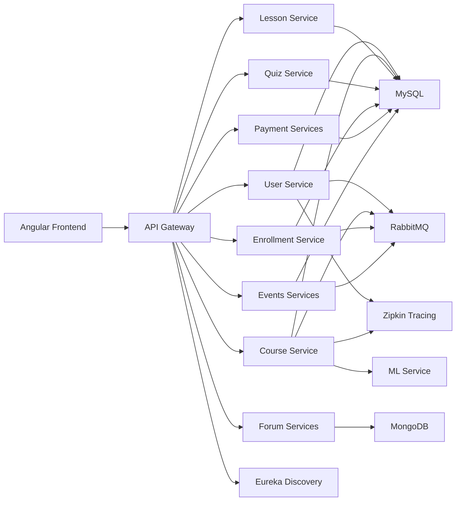

# Architecture

YBrainy is a modular microservices platform. The system separates user management, learning, community, events, payments, and AI/ML services so each domain can evolve independently.

## Main modules

| Module | Role |
| --- | --- |
| `user/` | Accounts, roles, authentication-adjacent services, frontend |
| `YBRAINY/` | Courses, lessons, quizzes, enrollment, ML service |
| `forum/` | Community, posts, comments, messaging |
| `ybrainy events/` | Events, inscriptions, feedback, event AI services |
| `payment/` | Cart, checkout, finance/payment workflows |
| `run-services/` | Local helper scripts for running individual modules |

## Infrastructure

| Component | Purpose |
| --- | --- |
| Docker Compose | Local orchestration |
| Eureka | Service discovery |
| Config Server | Shared Spring service configuration |
| RabbitMQ | Asynchronous communication |
| MySQL | Relational storage |
| MongoDB | Forum/community document storage |
| Zipkin | Distributed tracing |
